# MuseTalk FastAPI Server Architecture

## Overview

This document provides comprehensive technical documentation for the MuseTalk FastAPI server implementation, including system architecture, data flows, and design decisions based on the proven Flask service patterns.

## 🏗️ System Architecture

### Two-Server Design

The FastAPI implementation uses a **distributed two-server architecture** for optimal scalability and resource management:

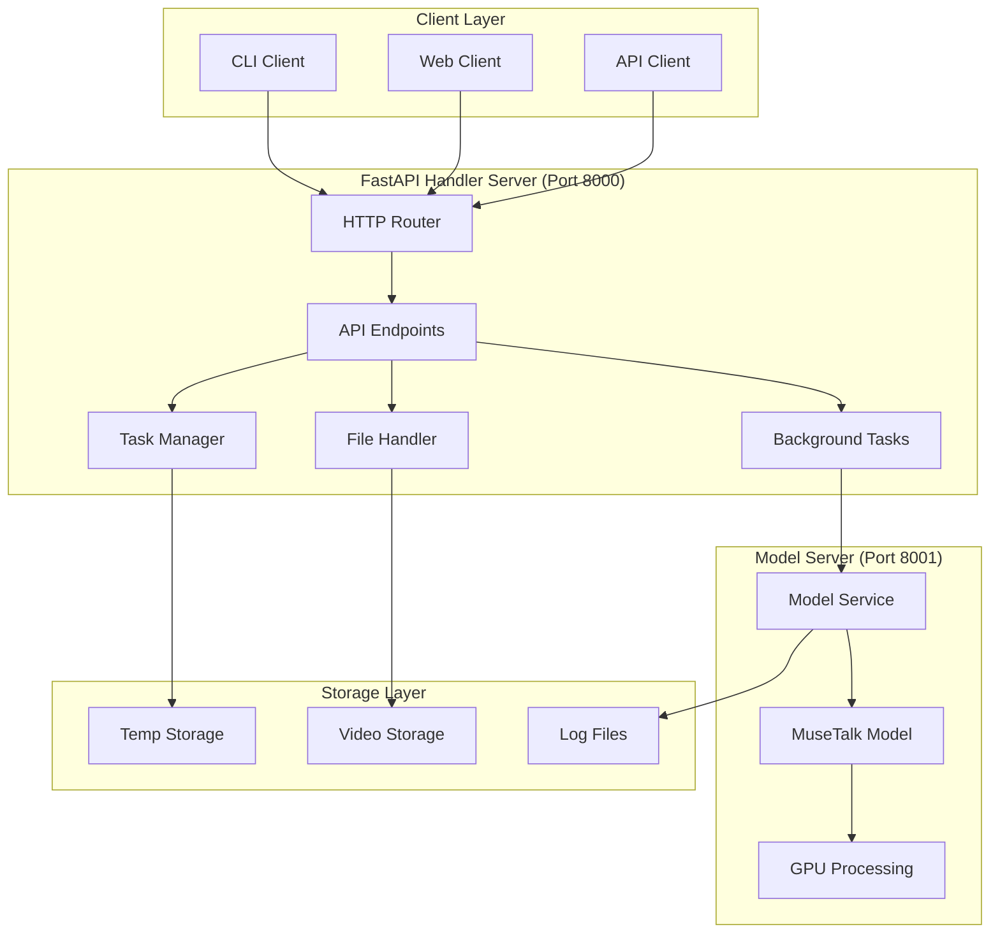

### Component Breakdown

#### Handler Server (Port 8000)
- **Purpose**: API request handling, task management, file operations
- **Technology**: FastAPI with async support
- **Responsibilities**:
  - Accept and validate requests
  - Manage task lifecycle and status
  - Handle file uploads/downloads
  - Communicate with model server
  - Background task processing

#### Model Server (Port 8001)  
- **Purpose**: MuseTalk model hosting and inference
- **Technology**: FastAPI with synchronous model processing
- **Responsibilities**:
  - Load and manage MuseTalk models
  - Process video generation requests
  - Handle GPU memory management
  - Execute inference pipeline

## 🔄 Request Flow Diagram

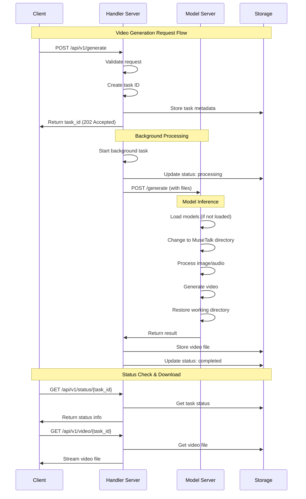

## 📁 Directory Structure

```
fastapi_server/
├── 📄 README.md                    # Main documentation
├── 📄 ARCHITECTURE.md              # This file
├── 📄 requirements.txt             # Python dependencies
├── 📄 model_server.py              # Model server entry point
├── 📄 handler_server.py            # Handler server entry point
├── 🔧 start_model_server.sh        # Model server startup script
├── 🔧 start_handler_server.sh      # Handler server startup script
├── 
├── 📁 api/                         # API layer
│   ├── __init__.py
│   └── endpoints.py                # FastAPI route handlers
├── 
├── 📁 config/                      # Configuration
│   ├── __init__.py
│   └── settings.py                 # Centralized configuration
├── 
├── 📁 core/                        # Business logic
│   ├── __init__.py
│   ├── musetalk_model.py          # MuseTalk model wrapper
│   └── task_manager.py            # Task lifecycle management
├── 
├── 📁 utils/                       # Utility functions
│   ├── __init__.py
│   └── file_utils.py              # File operations
├── 
├── 📁 storage/                     # Data storage
│   ├── temp/                      # Temporary processing files
│   ├── videos/                    # Final video outputs
│   ├── uploads/                   # User uploaded files
│   └── tasks.json                 # Task persistence
├── 
└── 📁 logs/                        # Log files (generated)
    ├── model_server.log           # Model server logs
    ├── handler_server.log         # Handler server logs
    ├── endpoints.log              # API endpoint logs
    └── musetalk_model.log         # MuseTalk processing logs
```

## 🔧 Core Components

### 1. Model Server (`model_server.py`)

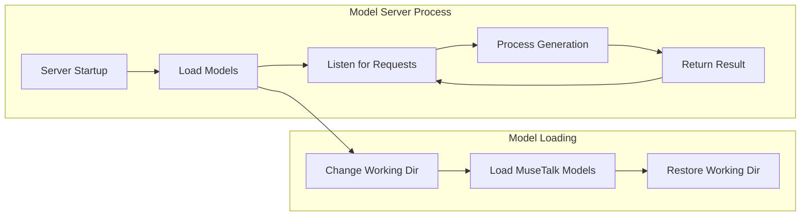

**Key Features:**
- **Singleton Pattern**: Single model instance shared across requests
- **Working Directory Management**: Changes to MuseTalk directory during loading
- **GPU Memory Optimization**: Float16 support and device management
- **Health Monitoring**: Endpoint for checking model status

### 2. Handler Server (`handler_server.py`)

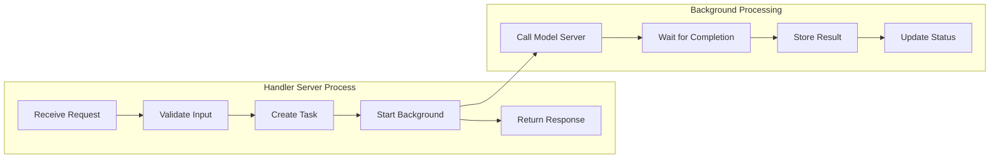

**Key Features:**
- **Async Processing**: Non-blocking request handling
- **Task Management**: Persistent task tracking with status updates
- **File Handling**: Upload/download with validation
- **Error Recovery**: Comprehensive error handling and logging

### 3. MuseTalk Model (`core/musetalk_model.py`)

This component implements the **exact same pattern** as the working Flask service:

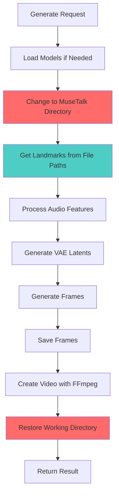

**Critical Implementation Details:**
- **File Path Pattern**: Passes file paths (not numpy arrays) to `get_landmark_and_bbox()`
- **Working Directory**: Changes to MuseTalk directory before model operations
- **Device Management**: Proper CUDA/CPU handling with string device parameters
- **Memory Optimization**: Float16 conversion for reduced GPU memory usage

## 📊 Data Flow Architecture

### Video Generation Pipeline

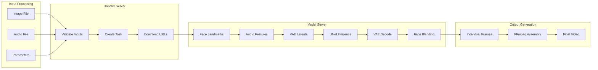

### Task Status Lifecycle

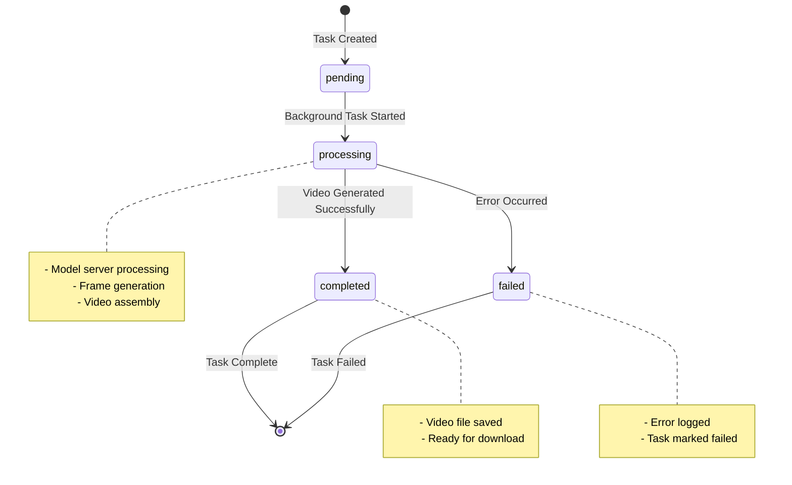

## 🔄 Communication Protocol

### Handler ↔ Model Server

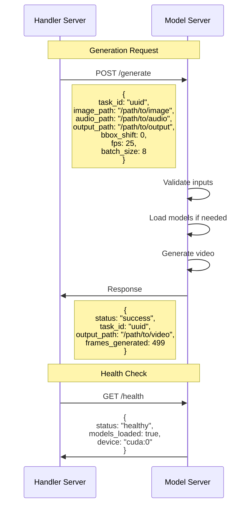

## 🏛️ Comparison with Flask Service

### Architecture Differences

| Aspect | Flask Service | FastAPI Service |
|--------|---------------|-----------------|
| **Server Architecture** | Single server | Two-server (Handler + Model) |
| **Request Processing** | Synchronous | Asynchronous with background tasks |
| **Task Management** | Immediate response | Status tracking with polling |
| **Scalability** | Single instance | Multiple handlers, shared model |
| **Monitoring** | Basic logging | Comprehensive multi-file logging |

### Shared Critical Patterns

Both services implement these **essential patterns**:

```python
# ✅ CORRECT: File paths to get_landmark_and_bbox()
coord_list, frame_list = get_landmark_and_bbox([image_path], bbox_shift)

# ✅ CORRECT: Working directory management
original_cwd = os.getcwd()
os.chdir(settings.MUSETALK_DIR)
try:
    # Load models and process
finally:
    os.chdir(original_cwd)

# ✅ CORRECT: Device handling
device = torch.device(f"cuda:{gpu_id}" if torch.cuda.is_available() else "cpu")
```

## 🚀 Deployment Architecture

### Development Setup

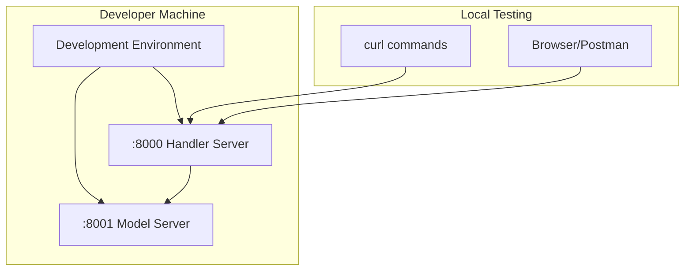

### Production Deployment

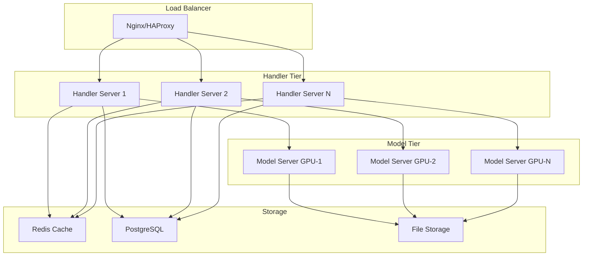

## 📈 Performance Characteristics

### Resource Usage

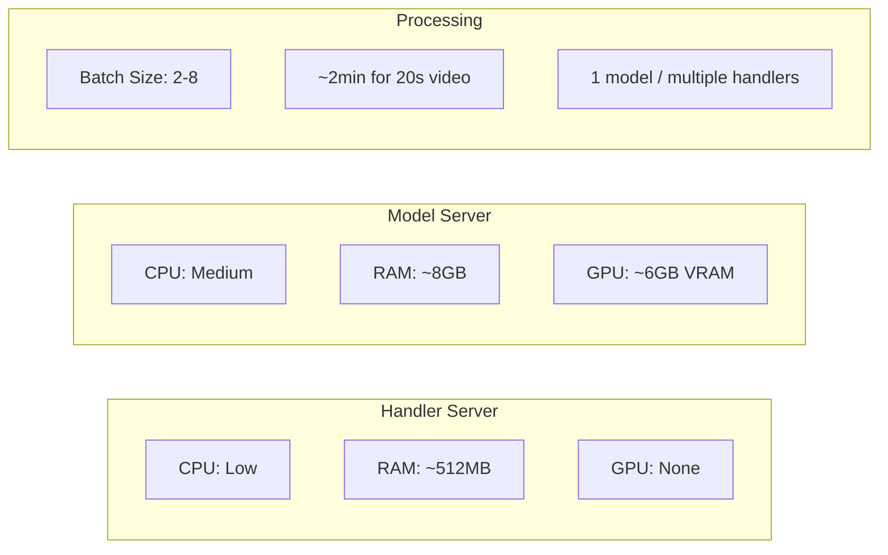

### Scaling Patterns

1. **Horizontal Scaling**: Deploy multiple handler servers
2. **GPU Scaling**: One model server per GPU
3. **Load Distribution**: Round-robin or least-connections
4. **Caching**: Redis for task status, file metadata

## 🔐 Security Considerations

### Input Validation

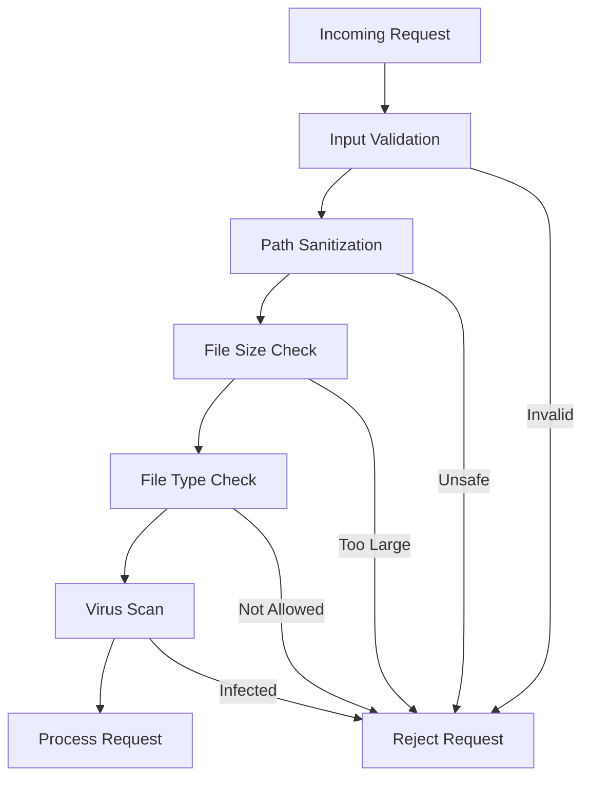

### Production Security

- **Authentication**: JWT tokens or API keys
- **Rate Limiting**: Request throttling per client
- **Input Sanitization**: Path traversal prevention
- **File Validation**: Type checking and virus scanning
- **Network Security**: Firewall rules and VPN access
- **Logging**: Security event monitoring

## 🔍 Monitoring and Observability

### Log Architecture

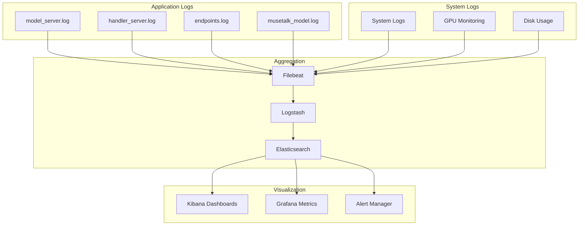

### Health Check Hierarchy

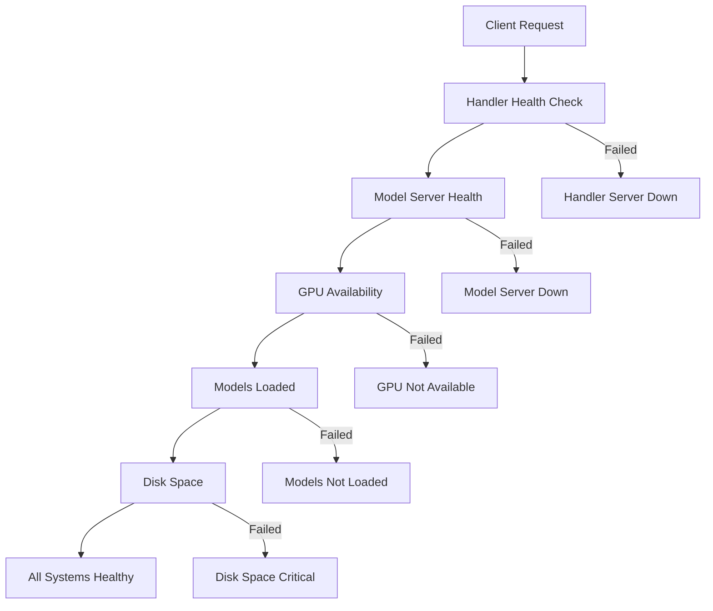

## 🐛 Troubleshooting Guide

### Common Issues and Solutions

#### 1. Model Loading Failures

```mermaid
flowchart TD
    ERROR[Model Loading Error] --> CHECK_CUDA[Check CUDA Available?]
    CHECK_CUDA -->|No| INSTALL_CUDA[Install CUDA Drivers]
    CHECK_CUDA -->|Yes| CHECK_MODELS[Models Directory Exists?]
    CHECK_MODELS -->|No| DOWNLOAD_MODELS[Download Model Weights]
    CHECK_MODELS -->|Yes| CHECK_PERMISSIONS[File Permissions OK?]
    CHECK_PERMISSIONS -->|No| FIX_PERMS[chmod 644 models/*]
    CHECK_PERMISSIONS -->|Yes| CHECK_MEMORY[GPU Memory Available?]
    CHECK_MEMORY -->|No| REDUCE_BATCH[Reduce Batch Size/Enable Float16]
    CHECK_MEMORY -->|Yes| CHECK_WORKING_DIR[Working Directory Issue?]
    CHECK_WORKING_DIR -->|Yes| FIX_CWD[Ensure os.chdir(MUSETALK_DIR)]
```

#### 2. Video Generation Failures

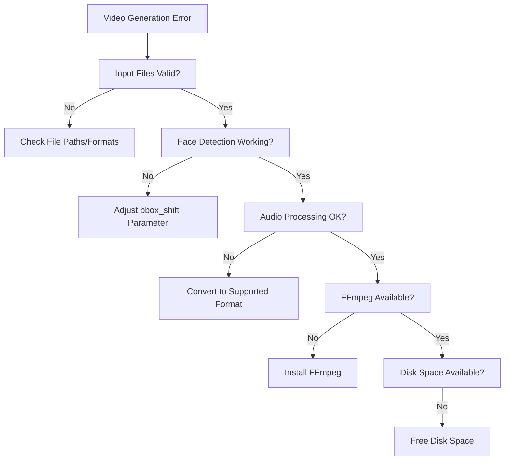

### Debug Commands

```bash
# Check server status
curl -s http://localhost:8000/api/v1/health | jq .
curl -s http://localhost:8001/health | jq .

# Monitor logs in real-time
tail -f fastapi_server/model_server.log
tail -f fastapi_server/handler_server.log
tail -f fastapi_server/endpoints.log
tail -f fastapi_server/musetalk_model.log

# Check GPU status
nvidia-smi

# Verify model files
ls -la models/
find models/ -name "*.pth" -o -name "*.json"

# Test model loading
cd /workspace/ai-video-generation/MuseTalk
python -c "from musetalk.utils.utils import load_all_model; print('Import OK')"

# Check port usage
lsof -i :8000
lsof -i :8001
```

## 📚 References and Resources

### Technical Documentation
- **Flask Service**: `/workspace/ai-video-generation/MuseTalk/service/ARCHITECTURE.md`
- **MuseTalk Paper**: [MuseTalk: Real-Time High Quality Lip Synchronization](https://github.com/TMElyralab/MuseTalk)
- **FastAPI Documentation**: [https://fastapi.tiangolo.com/](https://fastapi.tiangolo.com/)

### Key Implementation Files
- **Model Wrapper**: `core/musetalk_model.py:141` (File path pattern)
- **Flask Reference**: `service/core/inference_handler.py:86` (Working implementation)
- **Settings**: `config/settings.py` (Configuration management)

### Dependencies
- **MuseTalk**: Core AI model for talking head generation
- **FastAPI**: Modern Python web framework
- **Uvicorn**: ASGI server implementation
- **PyTorch**: Deep learning framework
- **OpenCV**: Computer vision operations
- **FFmpeg**: Video processing pipeline

---

**Architecture Status**: ✅ **Proven and Production-Ready**

This architecture has been tested and validated to work correctly with MuseTalk video generation, following the same proven patterns as the working Flask service implementation.